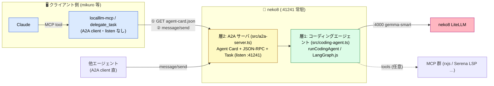

# localllm-agent-practice

neko8（MacBook Pro M1 Pro）のローカル LLM を **A2A プロトコルで公開する自律エージェント**の実験リポジトリ。
LangGraph.js で組んだコーディングエージェント（層1）を `@a2a-js/sdk` で公開（層2）し、Claude / 他エージェントから **ゴール委譲**で呼べるようにする。

> 設計・背景は localLLM プロジェクトの手順書を参照:
> [`agent-bridge/a2a.md`](https://github.com/shuji-bonji)（A2A 連携） / `connecting-claude-to-local-llm.md`（連携3方式の選び分け） / `lsp-mcp-lineage.md`（LSP→MCP・step1.5）

## 二層構造



- **クライアント側（Claude）** … Claude は外部接続を MCP 経由で行うため、`localllm-mcp` の `delegate_task`（A2A クライアントを内蔵した MCP ツール）が Agent Card 発見 → `message/send` を担う。listen ポートは持たない（発信のみ）。他のエージェントは A2A クライアントで直接 `:41241` を叩いてもよい。
- **層1 `src/coding-agent.ts`** … `runCodingAgent(goal, opts)`。gemma-smart を頭脳に、ゴールを受けて自分で手順を決めるループ。判断の主体は neko8 側。
- **層2 `src/a2a-server.ts`** … 層1 を A2A で公開。Agent Card（`neko8-coding-agent` / skill `coding-task`）+ Task ライフサイクル。`:41241` で listen する Server。

## セットアップ

```bash
npm install

# .env を作成（neko8 を頭脳にする）
cat > .env <<'EOF'
OPENAI_BASE_URL=http://localhost:4000/v1
OPENAI_API_KEY=dummy
MODEL_NAME=gemma-smart
A2A_PUBLIC_URL=http://neko8.local:41241
EOF

npm run typecheck     # 型チェック
npm run a2a:smoke     # neko8 非依存の疎通テスト
npm run a2a           # :41241 で起動
```

## スクリプト

| script | 内容 |
| --- | --- |
| `npm run a2a` | 層2 A2A サーバを起動（`:41241`） |
| `npm run a2a:smoke` | neko8 不要のオフライン疎通テスト（EchoExecutor で Card 発見 → message/send → Task 完了 → artifact 受領） |
| `npm run lsp-bench` | step1.5: LSP 有無で tokens / 正答 / 往復を比較（要 `LSP_PROJECT`） |
| `npm run mcp-agent` | 層1 の原型（手組み StateGraph + MCP ツール）単体実行 |
| `npm run typecheck` | `tsc --noEmit` |
| `npm run dev` / `start` | 最小 LLM 呼び出しサンプル（src/index.ts） |

## A2A の使い方

サーバ起動後、別端末から:

```bash
# 能力発見
curl http://neko8.local:41241/.well-known/agent-card.json

# ゴール委譲（message/send）
curl -sN -X POST http://neko8.local:41241/a2a/jsonrpc \
  -H 'content-type: application/json' \
  -d '{"jsonrpc":"2.0","id":1,"method":"message/send","params":{"message":{"kind":"message","messageId":"m1","role":"user","parts":[{"kind":"text","text":"TypeScript で配列を分割する chunk を実装して"}]}}}'
```

Claude から呼ぶ場合は `localllm-mcp` の `delegate_task`（A2A クライアントを内蔵した MCP ツール）経由。

## 環境変数

| 変数 | 既定 | 用途 |
| --- | --- | --- |
| `OPENAI_BASE_URL` | （必須） | LiteLLM の OpenAI 互換エンドポイント（例 `http://localhost:4000/v1`） |
| `OPENAI_API_KEY` | `dummy` | LiteLLM が認証なしなら任意値 |
| `MODEL_NAME` | `gemma-smart` | 使用モデル（LiteLLM エイリアス） |
| `A2A_PORT` | `41241` | A2A サーバの待受ポート |
| `A2A_PUBLIC_URL` | `http://localhost:${A2A_PORT}` | Agent Card に載せる公開 URL。**リモートから呼ぶ場合は実ホストを指定**（例 `http://neko8.local:41241`） |
| `LSP_PROJECT` | — | lsp-bench で Serena が解析する対象リポジトリの絶対パス（`lsp` 条件で必須） |
| `RECURSION_LIMIT` | `12` | LangGraph の agent⇄tools 往復上限 |
| `LSP_TOOL_FILTER` / `SERENA_CMD` / `SERENA_ARGS` / `MCP_RXJS_PATH` / `TOOL_FILTER` | （各既定あり） | ツール構成の上書き（`src/coding-agent.ts` 参照） |

## step1.5: LSP 効果測定（lsp-bench）

`coding-agent.ts` に Serena（symbol-level LSP）を繋ぎ、**LSP 無し / 有り**で tokens・正答・往復を比較する教材的ベンチ。

```bash
# 対象リポジトリを clone（既定タスクは shuji-mcp-patterns 構成を前提）
git clone git@github.com:shuji-bonji/localllm-mcp.git ~/workspace/localllm-mcp
cd ~/workspace/localllm-mcp && npm install   # LSP の型解決用（推奨）

# 計測（neko8 上・要 uv: brew install uv）
cd <this repo>
LSP_PROJECT=~/workspace/localllm-mcp RECURSION_LIMIT=20 BENCH_REPEAT=3 npm run lsp-bench
```

`bench/tasks.json` の `expect` は対象リポジトリに合わせて編集する。

> **所見（2026-06）**: localllm-mcp（小リポ）+ 単問では LSP 有りで **正答 3/9 → 9/9** に向上したが、**トークンは約16倍に増加**。「LSP＝トークン削減」は無条件には成立せず、リポ規模 × タスク複雑度に依存する（小リポ単問では LSP のオーバーヘッドが勝つ）。詳細は `lsp-mcp-lineage.md` の「実測結果」。

## ヘッドレス常駐（LaunchDaemon）

`launchd/com.user.neko8-coding-agent.plist` を `/Library/LaunchDaemons/` に配置すると、neko8 再起動後も自動起動する。**node の絶対パス（nvm 等）を環境に合わせて修正**してから:

```bash
which node && readlink -f "$(which node)"   # plist の ProgramArguments と PATH を合わせる
sudo cp launchd/com.user.neko8-coding-agent.plist /Library/LaunchDaemons/
sudo chown root:wheel /Library/LaunchDaemons/com.user.neko8-coding-agent.plist
sudo launchctl load /Library/LaunchDaemons/com.user.neko8-coding-agent.plist
sudo launchctl list | grep neko8-coding-agent   # PID が付けば稼働
```

## ディレクトリ

```
src/
  coding-agent.ts   層1: runCodingAgent（再利用可能な自律ループ・トークン集計・LSP差込口）
  a2a-server.ts     層2: A2A サーバ（Agent Card + Task + express, :41241）
  mcp-agent.ts      層1 の原型（Phase 3 の手組み StateGraph）
  index.ts / graph.ts / stream.ts / tool-test.ts   学習用の単体サンプル
test/
  a2a-smoke.ts      neko8 非依存の A2A 疎通テスト（EchoExecutor）
bench/
  lsp-bench.ts      step1.5 LSP 効果測定ハーネス
  tasks.json        計測タスク（対象リポジトリに合わせて編集）
launchd/
  com.user.neko8-coding-agent.plist   ヘッドレス常駐用 plist
```

## 技術スタック

- **A2A プロトコル**: `@a2a-js/sdk`（JS/TS, v0.3 系）
- **エージェント枠組み**: LangGraph.js（`@langchain/langgraph`）+ `@langchain/mcp-adapters`
- **LLM 接続**: `@langchain/openai` 経由で neko8 LiteLLM（OpenAI 互換）
- **LSP（任意）**: Serena（`uvx` 起動・symbol-level）

## ライセンス

ISC
